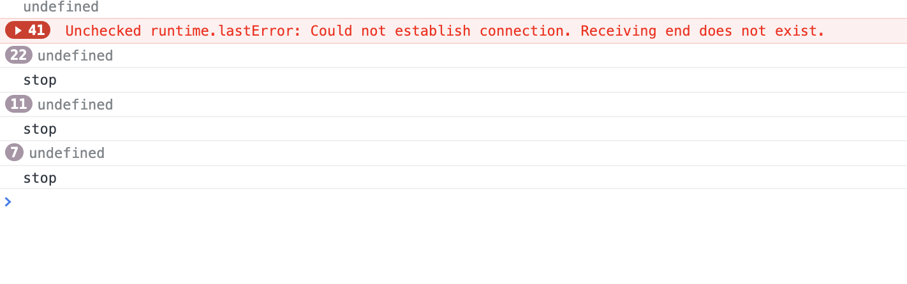

## 10월 05일

1. 더치트 익스텐션 중간리뷰

---

- 더치트 익스텐션의 주요기능은 2가지로 아이콘 클릭시 나오는 팝업 html에서 form을 이용하여 사용자가 입력한 내용을 submit 하는 간단한 기능이 있고<br>다른 하나는 백그라운드 서비스워커를 사용하여 번호를 우클릭하여 간단하게 검색할 수 있게 하는 기능이다.

- 첫번째 html을 이용한 기능은 간단하게 구현 가능했지만 두번째 백그라운드 서비스워커 기능은 구현이 조금 복잡하다.
<h2>manifest.json</h2>

```
{
  "name": "THECHEAT를 사용하여 검색",
  "description": "전화번호, 통장번호로 최근 3개월 피혜사례 검색",
  "version": "1.0",
  "manifest_version": 3,
  "action": {
    "default_popup": "popup.html"
  },
  "icons": {
    "16": "icon_thecheat_16.png",
    "32": "icon_thecheat_32.png",
    "48": "icon_thecheat_48.png",
    "128": "icon_thecheat_128.png"
  },
  "background": {
    "service_worker": "background.js"
  },
  "content_scripts": [
    {
      "matches": ["https://thecheat.co.kr/*"],
      "js": ["script.js"],
      "run_at": "document_start"
    }
  ],
  "permissions": ["contextMenus"]
}

```

- 10.5일 기준 Mainfest 파일 내용이다.
  - 새로 추가된 내용으로는 `content_scripts`로 매치패턴은 더치트 홈페이지에서만 가능하도록 `"matches": ["https://thecheat.co.kr/*"],` 를 입력했다
  - 컨텐츠 스크립트는 menifast파일 경로 근처에 있는 script.js를 사용하기 위해 `"js": ["script.js"],` 코드 입력했다.
  -  `run_at`은 컨텐트 스크립트가 웹 페이지에 삽입되는 시기를 제어한다. `document_idle(기본값), document_start, document_end`를 사용할 수 있으며 내가 사용한 document_start는 다른 dom이나 스크립트가 실행되기전에 컨텐츠 스크립트를 삽입한다.
  - 그리고 `contextMenus`를 제외한 다른 권한들은 허용하지 않아도 작동이 가능했기에 제외하였다.

<h2>popup.html</h2>

```html
<!DOCTYPE html>
<html lang="ko">
  <head>
    <meta charset="UTF-8" />
    <title>Document</title>
    <link rel="stylesheet" href="./main.css" />
  </head>
  <body>
    <h1>더치트 검색하기</h1>
    <form
      id="thecheatForm"
      method="post"
      action="http://192.168.1.102:9001/web/result.php"
      target="_blank"
    >
      <input type="hidden" name="url" value="chrome-ext.thecheat.co.kr" />
      <input
        placeholder="전화 또는 계좌번호 입력"
        name="keyword"
        type="text"
        id="key"
        autocomplete="off"
        minlength="7"
        required
      />
      <button id="search_btn">검색</button>
    </form>
    <hr />
    <p class="comment tcol-c">제공: 더치트(TheCheat.co.kr)</p>
  </body>
  <script src="./main.js"></script>
</html>
```

- `popup.html`의 내용으로 내용은 간단하게 submit에 필요한 두가지 값인 `url`, `keyword`를 input에 담아놓고 전송하는 html로 `url`은  `chrome-ext.thecheat.co.kr`로 고정이기에 hidden 속성을 사용해 사용자에게 보이지 않게 감춰놨지만 `keyword`의 경우 사용자의 입력이 필요하기에 입력제한을 넣어놨다.
> minlength="7" required
- 그리고 이것 외에 숫자와 - 만 입력 가능하도록 제한하는 것은 JS로 구현해 연결했다.
<h2>main.js</h2>

```javascript
function setInputFilter(textbox, inputFilter, errMsg) {
  ["input", "keydown", "mousedown", "focusout"].forEach(function (event) {
    textbox.addEventListener(event, function (e) {
      if (inputFilter(this.value)) {
        if (["keydown", "mousedown", "focusout"].indexOf(e.type) >= 0) {
          this.classList.remove("input-error");
          this.setCustomValidity("");
        }
        this.oldValue = this.value;
        this.oldSelectionStart = this.selectionStart;
        this.oldSelectionEnd = this.selectionEnd;
      } else if (this.hasOwnProperty("oldValue")) {
        this.classList.add("input-error");
        this.setCustomValidity(errMsg);
        this.reportValidity();
        this.value = this.oldValue;
        this.setSelectionRange(this.oldSelectionStart, this.oldSelectionEnd);
      } else {
        this.value = "";
      }
    });
  });
}
setInputFilter(
  document.getElementById("key"),
  function (value) {
    return /^\d*[\d,-]*\d*$/.test(value);
  },
  "숫자를 입력해 주세요."
);
```

- 앞에서 봤던 popup.html의 입력을 제어하기 위한 javascript코드이다.
- input에서 `"input", "keydown", "mousedown", "focusout"` 등의 입력이 있을시 정규표현식 `/^\d*[\d,-]*\d*$/` 에 맞는지 필터링 한 후 errMsg를 나타낸다.
- 이렇게 popup에 input은 html에 `minlength="7"` `required` 로 인해 keyword를 비워놓거나 7글자 이하로는 submit 할 수 없고 js로 숫자와 - 기호만 입력 가능하게 제어 하고있다.

<h1> 서비스워커와 콘텐츠스크립트</h1>

- 서비스워커와 콘텐츠스크립트를 쓰게 된 경위부터 설명하자면 `popup.html`의 경우 아이콘을 클릭해 팝업을 열어놓고 있어야지만 기능이 작동하기에 그런 제한 없이 사용할 수 있는 백그라운드 기능을 사용하였다.

- 하지만 manifest 가 V3가 나오면서 전과 같이 백그라운드html, js등을 사용할 수 없고 서비스워커라는 단일 js를 사용 가능했다, 그리고 서비스워커의 경우 단일 js로 되어있어서 DOM요소나 window 명령어를 사용 할 수 없다.
- 내가 생각한 기능을 구현하기 위해서는 DOM요소를 사용해야 했기에 `content_scripts`를 사용하여 구현하기로 했다.

- 기본적인 골조는 `background.js(서비스워커)`에서 `chrome.tabs.sendMessage` 를 사용해 메세지를 전달하면 `script.js(콘텐츠 스크립트)`에서 `chrome.runtime.onMessage`로 메세지를 받고 탭에 form을 만들어 submit 하는 구조이다.

```javascript
 var form = document.createElement("form");
  form.action = "http://192.168.1.102:9001/web/result.php";
  form.method = "POST";
  form.addEventListener("formdata", (e) => {
    var fd = e.formData;
    fd.append("keyword", `마우스오른쪽 클릭으로 선택한 번호`);
    fd.append("url", `chrome-ext.thecheat.co.kr`);
  });
  document.head.append(form);
  form.submit();
```

- 여기서 2가지 문제가 생기는데 하나는 submit에 필요한 요소 중 하나인 url이 해당 사이트에 url로 적용된다는 것이다.
예를 들어 네이버에서 번호를 찾아 마우스 오른쪽클릭으로 검색할 경우 url이 naver.com으로 되어 검색에 실패하는 것이다.
- 그래서 url이 없는 사이트나 더치트 홈페이지의 경우는 이러한 문제가 없이 진행되는 걸 확인 한 후 url이 없는 사이트를 열고 그 탭에 form요소를 만들어 submit 하려 했으나 2번째 문제가 생기는데 url이 없는 탭에서는 `content_script`를 적용 할 수 없었다.

- 그래서 더치트 홈페이지를 새탭에 열고 그 탭에 form 요소를 삽입하는 방식을 사용 하기로 했다.

<h2>backgorund.js</h2>

```javascript
chrome.contextMenus.create({
  id: "thecheat",
  title: '더치트 검색으로 "%s"를 조회합니다.',
  contexts: ["selection"],
  onclick: chrome.contextMenus.onClicked.addListener(function (info) {
    chrome.tabs.create(
      {
        url: `https://thecheat.co.kr/rb/?mod=_search`,
      },
      function (tab) {
          chrome.tabs.sendMessage(
            tab.id,
            { number: `${info.selectionText}` },
            (data) => {
              console.log(data);
            }
          );
      }
    );
  }),
});

```
<h2>script.js</h2>

```javascript
chrome.runtime.onMessage.addListener((message, sender, sendResponse) => {
  var form = document.createElement("form");
  form.action = "http://192.168.1.102:9001/web/result.php";
  form.method = "POST";
  form.addEventListener("formdata", (e) => {
    var fd = e.formData;
    fd.append("keyword", `${message.number}`);
    fd.append("url", `chrome-ext.thecheat.co.kr`);
  });
  document.body.append(form);
  form.submit();
  sendResponse("");
});
```


- 하지만 오류 발생
> Unchecked runtime.lastError: Could not establish connection. Receiving end does not exist.

- 어째서 이런 에러가 발생하는지 찾아보던 중 새탭을 열 경우 콘텐츠스크립트가 로딩되는 시간이 있기에 발생하는 오류라고 판단되었다.
- 그래서 서비스워커에서 보내는 메세지를 탭을 열고나서 시간을 두고 전송하면 될까 싶어서 `setTumeout`을 사용해 보았다


<h2>backgorund.js</h2>

```javascript
// chrome.contextMenus.create({
//   id: "thecheat",
//   title: '더치트 검색으로 "%s"를 조회합니다.',
//   contexts: ["selection"],
//   onclick: chrome.contextMenus.onClicked.addListener(function (info) {
//     chrome.tabs.create(
//       {
//         url: `https://thecheat.co.kr/rb/?mod=_search`,
//       },
        setTimeout(() => {
          chrome.tabs.sendMessage(
            tab.id,
            { number: `${info.selectionText}` },
            (data) => {
              console.log(data);
            }
          );
        }, 400);
//       }
//     );
//   }),
// });

```

- 이러한 방식으로 실행하니 동작을 했다. 하지만 또 문제가 발생하였는데 컨텐츠 스크립트가 로딩되는 시간이 모두 달라서 어떤 때는 순식간에 동작하기도 했지만 가끔 1초가 넘도록 로딩이 안되서 다시 에러가 뜨는 경우가 왕왕 벌어졌다.

- 물론 시간을 넉넉하게 두고하면 문제는 없었지만 그러면 기다리는 시간도 길어지고 불편하여 다른 방법을 생각하기로 했다.

- `Unchecked runtime.lastError: Could not establish connection. Receiving end does not exist.` 에러를 해결하려고 여러가지 방법을 써봤지만 들어간 시간에 비해 이렇다 할 대안이 나오지 않자, 우선 에러는 무시한채 동작은 가능하도록 노선을 변경하였다.

- 그래서 생각한게 `setTimeout`으로 시간을 정해놓고 기다리는게 아닌 새탭이 콘텐츠 스크립트를 로딩 완료할때까지 계속 메세지를 보내도록 `setInterval`을 사용했다.

<h2>backgorund.js</h2>

```javascript
// chrome.contextMenus.create({
//   id: "the_cheat_search",
//   title: '더치트 검색으로 "%s"를 조회합니다.',
//   contexts: ["selection"],
//   onclick: chrome.contextMenus.onClicked.addListener(function (info) {
//     chrome.tabs.create(
//       {
//         url: `https://thecheat.co.kr/rb/?mod=_search`,
//       },
      function (tab) {
        let send = setInterval(() => {
          chrome.tabs.sendMessage(
            tab.id,
            { number: `${info.selectionText}` },
            (data) => {
              console.log(data);
              if (data == "stop") {
                clearInterval(send);
              }
            }
          );
        }, 50);
//       }
//     );
//   }),
// });
```

<h2>script.js</h2>

```javascript
// chrome.runtime.onMessage.addListener((message, sender, sendResponse) => {
//   var form = document.createElement("form");
//   form.action = "http://192.168.1.102:9001/web/result.php";
//   form.method = "POST";
//   form.addEventListener("formdata", (e) => {
//     var fd = e.formData;
//     fd.append("keyword", `${message.number}`);
//     fd.append("url", `chrome-ext.thecheat.co.kr`);
//   });
//   document.body.append(form);
//   form.submit();
  sendResponse("stop");
// });
```
- setTimeout과는 다르게 0.05초 마다 메세지를 보내는 방식으로 콘텐츠스크립트가 반응 할때까지 `chrome.tabs.sendMessage` 반복 시키다가 콘텐츠 스크립트가 반응하여 `sendResponse("stop");` 로 "stop"을 반환한다.

- 반환 받은 data를 서비스워커에서 stop이 맞는지 확인후 `clearInterval`로 인터벌을 멈추게 만들었다.

- 우선 동작하는 과정을 확인하기 위해 `console.log(data);`를 잠시 입력해서 확인해보면



- 위와 같이 연결이 안되어 있을 때는 undefined를 반환하지만 연결시 stop을 반환하고 인터벌을 종료 시키는 걸 볼 수있다.

- 그리고 총 3번 시도했는데 전부 인터벌 간격이 다른것을 알 수 있듯이 콘텐츠스크립트가 로딩되는 시간을 조절할 수 있다면 위처럼 점점 쌓여가는 에러메세지를 안 볼 수 있을갓이다...

- 우선 이렇게 해서 마우스 오른쪽 클릭으로 검색했을때 내용이 안나오는 일은 없이 정상적으로 작동한다.

> unchecked runtime.lasterror: cannot create item with duplicate id the_cheat_search

- 가끔가다 이런 오류가 뜨는데 동작에는 문제를 끼치지는 않지만 왜 생기나해서 검색해보니 context 메뉴를 만들고 나면 가끔씩 나오는 버그라고 한다.

 
<h2>backgorund.js</h2>

```javascript
chrome.contextMenus.removeAll(function () {
  // chrome.contextMenus.create({
  //   id: "the_cheat_search",
  //   title: '더치트 검색으로 "%s"를 조회합니다.',
  //   contexts: ["selection"],
  //   onclick: chrome.contextMenus.onClicked.addListener(function (info) {
  //     chrome.tabs.create(
  //       {
  //         url: `https://thecheat.co.kr/rb/?mod=_search`,
  //       },
  //       function (tab) {
  //         let send = setInterval(() => {
  //           chrome.tabs.sendMessage(
  //             tab.id,
  //             { number: `${info.selectionText}` },
  //             (data) => {
  //               console.log(data);
  //               if (data == "stop") {
  //                 clearInterval(send);
  //               }
  //             }
  //           );
  //         }, 50);
  //       }
  //     );
  //   }),
  // });
});
```

- 그래서 `chrome.contextMenus.removeAll` 를 사용하여 contextmesu를 생성하기 전에 removeAll로 전부 삭제해주는 방식을 사용했다.
