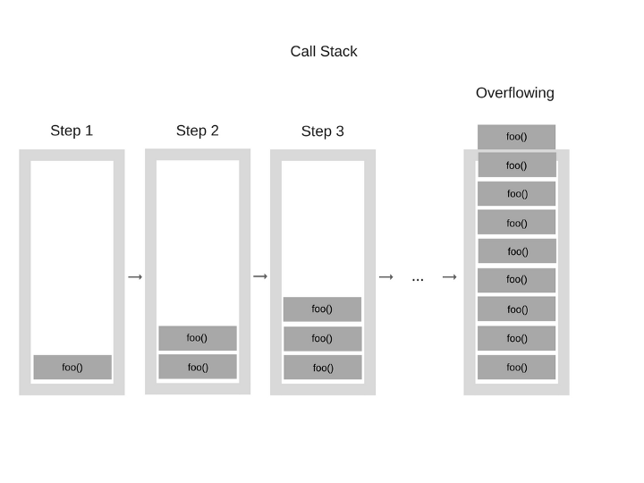

# 11월 24일

1. JavaScript 개발자가 알아야할 33가지 개념

2. (33가지개념) #1 호출 스택

---

## 1. JavaScript 개발자가 알아야할 33가지 개념

> 원본 프로젝트 https://github.com/leonardomso/33-js-concepts<br>
> 힌글화 버전 https://github.com/yjs03057/33-js-concepts

- 자바스크립트의 개발을 하다보면 예상치 못한 사이드이펙트를 마주할때가 많다. 이런 잔실수나 오류가 반복되는 것은 기초적인 개념이 잡혀있지 않고 그저 코드만 복붙하기 때문, 기초개념을 확실히 잡자.

## 2. (33가지개념) #1 호출 스택

우선 자바스크립트 엔진은 힙과 단일 콜스택으로 구성된 단일 스레드 인터프리터다.<br>말이 쉽게 풀어말하자면 자바스크립트는 단일스레드, 즉 한번에 한가지 작업을 다룰 수 있고 힙과 단일 콜스택(호출스택)으로 구현되어있다는 것이다.

- 힙

  - 메모리 할당이 발생하는 곳으로 오브젝트(객체)들과 변수들의 모든 메모리 할당이 여기서 일어나게 된다.

- 호출스택(콜스택)
  - 호풀스택은 주로 함소 호출에 사용된다. 호출 스택은 단일이므로 함수 실행은 위에서 아래로 한번에 하나씩만 수행된다, 즉 호출스택은 동기식이다.
  - 함수의 호출을 기록하는 자료구조로 어떤 함수를 실행시컀을때 무언가를 올리는(push) 행위를 한다. 그리고 함수를 반환 받았을때 우리는 스택의 맨위를 가져오는(pop) 것이다.

 <center></center>

- 이러한 호출스택의 각 항목을`스택 프레임` 이라고 한다.

- 큐

  - 자바스크립트 런타임은 메세지 큐를 가지고 있다. 메세지 큐는 실행될 콜백이나 메게지에 대한 리스트로, 스택이 충분한 공간을 가지고 있을때 메세지는 큐 밖으로 나오게 되고 가지고 있던 함수 목록이 실행된다.

  - 이벤트들에 대한 콜백이 제공되었다고 가정할때 이 메세지들은 외부 비동기 이벤트들에 대한 응답으로 큐에 쌓인다, 여기서 외부 비동기 이벤트란 마우스클릭, HTTP 요청등을 말한다.

  - 스택이 다시 비게되면 메세지 수행도 끝나게 된다, 만약 사용자가 버튼을 눌렀는데도 아무런 콜백함수도 등록되어 있지 않다면, 어떠한 메시지도 큐에 들어가지 않을 갓이다.

```javascript
function firstFunction() {
  console.log("Hello from firstFunction");
}

function secondFunction() {
  firstFunction();
  console.log("The end from secondFunction");
}

secondFunction();
```

이러한 코드가 실행되는 상황을 나열하자면

1. secondFunction()실행되면 빈 스택 프레임이 생성
2. secondFunction() 가 firstFunction()를 콜해서 스택에 푸시
3. firstFunction()가 "Hello from firstFunction"을 반환하고 콘솔에 출력합니다.
4. firstFunction()가 스택에서 pop된다.
5. 그다음 실행순서가 secondFunction()에게로 넘어가 “The end from secondFunction”을 반환하고 콘솔에 출력
6. secondFunction() 역시 스택에서 pop되고 메모리를 지운다.

- 스택 오버플로우

  - 이렇게 스택이 쌓이는 와중에 끝, 반환이 없는 재귀함수를 사용하게 되면 무한루프에 빠지며 스택오버플로가 발생하게 됩니다.

  - 즉 브라우저에는 스택오류가 발생하기 전에 수용할 수 있는 최대 스택 호출이 있고 그것을 넘어가게되면 이러한 오류가 발생하게 되는 것

<center></center>
<br>

- 이벤트 루프

  - 싱글 스레드 언어인 JS는 스택에 쌓인 함숟즐에게 어떠한 값을 반환하기 전까지는 버튼이나 랜덩링이 필요한 무언가를 클릭시 스택이 막혀있기에 어떠한 반응도 일어나지 않을것이다. 그렇다면 싱글 스레드로 이상적인 환경을 어떻게 만들 수 있을까?

  - 가장 쉬운 해결책은 비동기 함수들을 이용하는 것, 비동기 콜백을 이용한다, 모든 비동기 콜백은 코드에서 읽히자마자 바로 실행되지 않고 잠시 후에 실행되는대 이런 비동기 콜백은 대체 어디로 가고 어떻게 다뤄지게 되는가

  <br>

<center></center>

<br>

- 위의 코드에서 자바스크립트의 네트워크 액션 요청(request in action)을 보자.

  1. 요청 함수가 실행됩니다. 요청이 들어온 때에 실행될 콜백으로 onreadystatechange 이벤트 안에 있는 익명의 함수를 넘깁니다.
  2. "Script call done!"은 동기 함수로 코딩되어 있기 때문에 바로 콘솔의 output에 들어갑니다.
  3. 비동기 함수가 실행될 때가 됐을 때, 서버로부터의 응답이 오고 body부분을 콘솔에 출력하며 콜백이 실행됩니다.

- 응답(response)에서의 호출자(caller)의 분리는 자바스크립트 런타임이 당신의 비동기 명령이 완료되고 콜백이 호출될 때까지 기다리는 동안 다른 일을 하는 것을 허용합니다. 2여기에서는 브라우저 API들이 작동합니다. DOM 이벤트들, http요청들, setTimeout과 같은 비동기 이벤트들을 다루기 위해 브라우저 내부 C++로 구현된 코드들에 의해 만들어진 기본적인 스레드들(threads)의 API를 호출합니다. (이 것들을 이해했다면 앵귤러2에서, 런타임 변화 감지를 일으키기 위한 이런 API들을 몽키패치(강제로 오버라이딩하여 프로그램의 행동을 바꾸는 것)하기 위해 Zones가 사용됐다는 것을 알게 됩니다.)

>DOM events, http request, setTimeout과 같은 비동기 이벤트들을 다루기 위한 브라우저의 웹 API 스레드들은 브라우저 내부에 C++로 구현되어 만들어졌습니다.

- 지금 이 웹 API들은 스스로 자신들의 실행코드를 스택에 넣을 수 없습니다. 만일 이런 일이 일어났다면, 당신의 코드 중간에 랜덤하게 나타나게 될 것입니다. 위에서 다뤄진 메세지 콜백 큐가 이것을 증명합니다. 3현재 실행 중인 코드가 끝난다면 웹 API중 어느 하나가 콜백을 큐에 넣습니다. 이벤트 루프는 큐 안의 콜백들을 스택이 비었을 때 밀어넣는 일을 담당합니다. 이벤트 루프가 하는 기본적인 일 중에 하나는 스택과 작업 큐를 보고 스택이 비었을 때 큐에 첫번째에 있는 콜백을 스택에 밀어넣는 일을 합니다. 다른 메시지가 들어오기 전에 각각의 메시지 또는 콜백들은 작업을 완료합니다.

```javascript
while (queue.waitForMessage()) {
	queue.processNextMessage();
}
```

>계속하여 메시지를 기다리다가 다음 메시지를 진행시키는 역할을 합니다.

<center></center>

- 메시지들은 웹 브라우저에서 언제든 이벤트가 발생했을 때 추가됩니다. 그리고 이벤트들에는 이벤트 리스너가 붙어있죠. 만일 리스너가 없다면 발생한 이벤트는 그냥 사라집니다. 언제든 우리가 웹 브라우저에서 어떤 요소를 클릭했을 때, 클릭 이벤트 핸들러는 큐에 메시지를 추가합니다. 웹브라우저의 다른 이벤트들도 동일합니다. 이러한 콜백 함수 호출은 콜스택 안에서 초기의 프레임의 역할을 합니다. 그리고 자바스크립트는 싱글스레드이기 때문에, 추가적인 폴링 중 메시지와 프로세싱은 잠시 중단되고 스택에 있는 모든 호출들의 return을 기다립니다. 그리고 동기 함수들은 스택에 새로운 콜 프레임들을 추가합니다.

- 이벤트 루프 시각화

<center></center>

<center></center>

1. 함수를 실행하면 그 삼수는 콜스택에 추가됩니다. 이것은 선입후출(FILO)의 스택이며 함수가 값을 반환하면 그 함수는 스택에서 빠져나와 사라짐,
그림에서도 볼 수 있듯이 respond 함수는 setTimeout함수를 반환합니다. setTimeout함수는 Web API에서 제공되는 함수로, 메인 스레드를 막지 않고 작업을 지연시킬 수 있습니다. setTimeout에 전달한 콜백 함수인 화살표 함수 ()=>{return 'Hey'}가 Web API에 추가됩니다. 그동안 setTimeout 함수와 respond 함수는 그들의 값을 반환했으니, 스택에서 빠져나옵니다.

<center></center>

2. Web API 안에서, 타이머는 setTimeout에 전달한 두 번째 인자 1000ms 동안 실행됩니다. 콜백은 즉시 호출 스택에 추가되지 않고, 대신 '큐(대기열)'에 전달됩니다.

<center></center>

3. 다소 혼란스러울수 있으나 1000ms 후 콜스택에 추가되어 값을 반환한다는 의미가 아니라, 1000ms후에 단순히 큐에 추가된다는 뜻, 즉 큐는 대기열이므로 해당함수는 자기차례를 기다려야한다, 
<center></center>

4. 이전에 호출되었던 모든 함수가 값을 반환하고 콜 스택을 빠져나갔다면 큐에 있는 첫번째 요소가 콜스탸택에 추가된다. 즉 이벤트루프의 유일한 작업 (큐와 콜스택의 연결)을 수행한다. 이 경우, 다른 함수는 호출되지 않았고, 이는 콜백함수가 큐의 펏번재요소일때 콜스택이 비어있었음을 의미한다.

<center></center>

5. 콜백함수가 콜 스택에 후가되고, 호출되고, 값을 반환하고, 스택을 빠져나갑니다.


```javascript
const foo = () => console.log("First");
const bar = () => setTimeout(() => console.log("Second"), 500);
const baz = () => console.log("Third");

bar();
foo();
baz();
```

위와 같은 코드를 실행하면 콘솔에는 어떻게 실행되냐면


<center></center>

1. 우선 bar()을 호출하여 setTimeout을 반환, setTimeout을 전달한 콜백은 WebApi에 추가되고 setTimeout, bar는 콜스택에서 빠져나온다.

2. 타이머가 실행괴고, 그동안 foo가 호출되고 First를 기록한다. foo는 undefined를 반환하며 baz가 호출되고 콜백이 콜스택에 기록됩니다.

3. baz가 Third를 기록하며 이벤틀 루프는 baz가 값을 반환한 후 콜스택이 비어있음을 확인, 그 후 콜백이 콜스택에 추가, 콜백이 실행되며 Second가 기록된다.