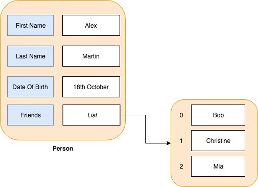
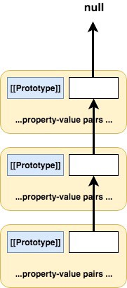
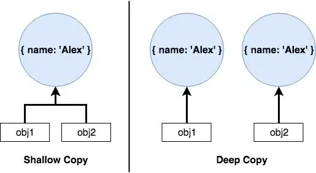
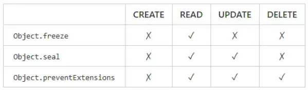

# 11월 28일

1. (33가지개념) #2 자바스크립트의 원시타입
2. (33가지개념) #2 자바스크립트의 원시타입 - 객체

---

## 1. (33가지개념) #2 자바스크립트의 원시타입

### 원시타입

- 자바스크립트에는 `7가지종류의 원시데이터타입`이 있다, 원시데이터타입이란 자바스크립트에서 객체가 아닌 것들이며 값 그자체로 지정된 것들이다.

  - Booleans true or false
  - null
  - undefined
  - number (두 배의 정밀함을 가진 64-bit float입니다. 자바스크립트에는 정수 타입은 존재하지 않습니다.)
  - bigint
  - string
  - symbol (ES6에서 처음 생긴 원시타입입니다.)

- 이 7가지의 원시 타입들에 더해 ECMAScript 표준은 Object를 정의했다. object란 키-값 저장소라고 생각하면 간단하다.

```javascript
const object = {
  key: "value",
};
```

- object는 `Primitive Type(원시타입)`이 아니다. 그리고 object라는 개념은 함수들과 배열들도 포함한다.

```javascript
// Primitive Types
true instanceof Object; // false -> boolean
null instanceof Object; // false -> null
undefined instanceof Object; // false -> undefined
0 instanceof Object; // false -> number
"bar" instanceof Object; // false -> string

// Non-primitive types
const foo = function () {};
foo instanceof Object; // true -> function;
```

- 원시타입에는 어떠한 메서드도 붙어있지 않다, 예를 들면 undefined.toString()과 같은 형태의 메서드는 없다. 이러한 특성 때문에, 원시 타입은 `변하지 않는 속성(immutable)속성`을 갖는다. 왜냐하면 원시타입은 자신을 변경할 수 있는 메서드를 갖지 않기 때문이다. 물론 변수에 원시타입을 얼마든지 재할당 할 수 있지만 이것은 실제로 변수에 할당되었던 원시타입의 값이 바귀는것이 아니라 새로운 원시타입의 값이 들어가는 개념이다. 원시타입 값 자체는 절대 바뀔 수 없다.

- 원시타입은 참조(reference)로 저장되는 object와 다르게 값 그자체로 저장되어 있다. 값이 동일한지 체크할 때 앞의 문장이 정확히 무슨 의미인지 알 수 있으며 아래 배열과 객체는 내용은 같지만 다른 곳을 참조하고 있기에 false를 리턴한다.

```javascript
"dog" === "dog"; // true
14 === 14; // true

{} === {}; // false
[] === []; // false
(function () {}) === (function () {}); // false
```

> 원시 타입은 값(value)으로 저장되고, 객체들은 참조(reference)로 저장됩니다.

### 함수

- 함수는 특별한 프로퍼티들을 가진 새로운 형태의 객체로써 생성자나 콜과 비슷하다.

```js
const foo = function (baz) {};
foo.name; // "foo"
foo.length; // 1
```

- 일반적인 객체와 같이 함수에 새로운 프로퍼티를 추가하는 것도 가능하다.

```js
foo.bar = "baz";
foo.bar; // "baz"
```

- 함수의 이러한 특성은 함수를 1급객체로 만드는데 왜냐하면 다음과 같은 조건을 만족하기 때문이며 이러한 특성은 자바스크립트의 객체들이 갖는 특성과 같다.
  - 다른 함수의 인자값으로 넘겨질 수 있다.
  - 변수나 데이터에 할당 가능
  - 객체의 리턴값으로 리턴 가능하다.

### 메서드

- 메서드는 함수와 같이 객체의 프로퍼티입니다.

```js
const foo = {};
foo.bar = function () {
  console.log("baz");
};
foo.bar(); // "baz"
```

### 생성자함수

- 자바스크립트에서 생성자함수란 리턴값으로 생성하는 함수를 개체 그 자체로서 반환하는 함수이다. 같은 코드를 공유하는 여러가지 객체들을 갖고 싶다면 생성자함수를 삽입하는것이 좋다.

```js
const Foo = function () {};
const bar = new Foo();
bar; // {}
bar instanceof Foo; // true
bar instanceof Object; // true
```

- 생성자함수는 object를 리턴하게된다. object에 새로운 프로퍼티들을 할당하기 위해 this를 함수의 몸통 안에서 사용할 수 있다. 우리가 "baz" 값으로 초기화된 bar라는 프로퍼티를 가진 object를 많이 만들고 싶다면 그 로직을 캡슐화하는 Foo가 있다.

```js
const Foo = function () {
  this.bar = "baz";
};
const qux = new Foo();
qux; // { bar: "baz" }
qux instanceof Foo; // true
qux instanceof Object; // true
```

- new 키워드 없이 단순히 Foo() 함수를 실행한다면 일반적인 함수처럼 동작한다. 위 코드에서 this는 실행컨텍스트(Execution Context)와 응답을 주고 받는다. 만일 우리가 Foo()라는 함수를 전역 컨텍스트에서 실행시키게 된다면 전역 컨텍스트 시점의 this인 window 객체에 bar이라는 프로퍼티가 추가된다. 반대로 말하면 일반 함수를 생성자 함수로 실행한다면 함수의 역할을 한다기보다 그저 새로운 함수 오브젝트를 반환할 뿐이다.

```js
const pet = new String("dog");
// pet은 원시 타입의 "dog" 값을 갖는 것이 아니라 생성자 함수로 생성된 String 객체를 갖게 됩니다.
```

### 래퍼 오브젝트(Wrapper Object, 포장 오브젝트)

- String, Number, Boolean과 같은 원시타입을 new 키워드로 생성하면 원시타입에 대한 래퍼오브젝트가 생성된다. String은 문자열이 인자로 들어왔을땨, 원시 문자열을 생성하는 전역 함수이다. 인자로 들어온 값을 문자열로 바꾼다.

```js
String(1337); // "1337"
String(true); // "true"
String(null); // "null"
String(undefined); // "undefined"
String(); // ""
String("dog") === "dog"; // "true"
typeof String("dog"); // "string"
```

- 하지만 new 키워드를 붙인다면 String은 여전히 생성자 함수로도 쓰일 수 있다.

```js
const pet = new String("dog");
typeof pet; // "object"
pet === "dog"; // false
```

- 이러한 생성자는 래퍼 오브젝트라고 불리는 새로운 Object를 만들어 낸것이다. 새로운 Object는 dog이라는 문자열을 다음과 같은 프로퍼티로 나타낸다.

```js
{
	0: "d",
    1: "o",
    2: "g",
    length: 3
}
```

### 오토박싱(Auto-Boxing)

- 원시타입 문자열 생성자와 일반 오브젝트 생성자 둘 다 String 함수를 이용한다. 더욱 흥미로운 것은 원시 문자열 타입에서 .constructor 를 이용하여 생성자 프로퍼티를 확인할 수 있다는 것이다. 원시타입에서는 메서드를 가질 수 없지만 여기서 오토박싱이라는 일이 벌어진다.

```js
const pet = new String("dog");
pet.constructor === String; // true
String("dog").constructor === String; // true
```

- 우리가 특정한 원시타입에서 프로퍼티나 메서드를 호출하려 할 때, 자바스크립트는 처음으로 이것을 임시 래퍼 오브젝트로 바꾼 뒤에 프로퍼티나 메서드에 접근한다. 중요한 것은 이 과정에서 원본에 아무런 영향을 미치지 않는다.

```js
const foo = "bar";
foo.length; // 3
foo === "bar"; // true
```

- length라는 프로퍼티에 접근하기 위해 자바스크립트는 foo를 오토박싱하고 이것을 래퍼오브젝트에 넣는다. 그리고 래퍼오브젝트의 length 프로퍼티에 접근하고 값을 이용한 뒤에는 지워버린다. 이 모든 과정은 foo라는 원시타입 변수에 전혀 영향을 미치지 않고 foo는 여전히 원시타입 문자열이다.

- 이러한 일련의 과정은 우리가 원시타입에 프로퍼티를 할당하려고 할 때 자바스크립트가 왜 아무런 경고나 에러메시지를 출력하지 않는지를 알려준다. 프러퍼티를 할당할 때 잠시 원시 타입을 이용한 래퍼 오브젝트를 만들고 거기에 할당하면 되기에 아무런 경고를 하지 않는것이다, 만일 undefined나 null과 같이 래퍼오브젝트가 없는 원시 타입에 대해서 프로퍼티를 할당하려고 하면 자바스크립트는 에러메시지를 나타낸다.

### Primitive Types

- Booleans

  - true 및 false를 나타냅니다. 다른 유형의 값을 부울로 암시적으로 변환할 수 있다.

  ```js
  if (42) {
  } // 42 => true
  if ("") {
  } // "" => false
  ```

  - 비부울 유형을 부울유형으로 변환시 명시적으로 Boolean(x) 또는 !!x를 사용 할 수 있다.

  ```js
  // @flow
  function acceptsBoolean(value: boolean) {
    // ...
  }

  acceptsBoolean(0); // Error!
  acceptsBoolean(Boolean(0)); // Works!
  acceptsBoolean(!!0); // Works!
  ```

  - boolean과 Boolean은 다른 유형입니다.
    - boolean은 원시타입으로 true와 false값을 가진다, Null 체크가 불힐요한 경우 사용하고 언박싱을 할 필요가 없기에 시간 단축이 가능
    - Boolean은 참조타입(reference type)으로 true, false, Null값을 가진다. Null체크가 필요할때 참조형을 사용한다

- Number

  - 다른 언어와 달리 js에서는 한가지 유형의 숫자만 있다. number유형은 js의 숫자로 간주하는 모든것을 캡쳐한다.

  ```js
  // @flow
  function acceptsNumber(value: number) {
    // ...
  }

  acceptsNumber(42); // Works!
  acceptsNumber(3.14); // Works!
  acceptsNumber(NaN); // Works!
  acceptsNumber(Infinity); // Works!
  acceptsNumber("foo"); // Error!
  ```

  - number그리고 Number는 다른 유형이다.

- String

  - js는 문자열과 다른유형의 값을 연결하여 암시적으로 문자열로 변환한다.

  ```js
  "foo" + 42; // "foo42"
  "foo" + {}; // "foo[object Object]"
  ```

  - 문자열과 숫자를 문자열에 연결할때만 허용한다.

  ```js
  "foo" + "foo"; // Works!
  "foo" + 42; // Works!
  "foo" + {}; // Error!
  "foo" + []; // Error!
  ```

  - 명시적으로 다른 유형을 문자열로 변환해야한다. 문자열 메서드를 사용하거나 값을 문자열화하는 다른 메서드를 사용하여 이 작업을 수행 할 수 있다.

  ```js
  "foo" + String({}); // Works!
  "foo" + [].toString(); // Works!
  "" + JSON.stringify({}); // Works!
  ```

  - string그리고 String는 다른 유형이다.

- null과 underfined

## 2. (33가지개념) #2 자바스크립트의 원시타입 - 객체
### 객체

- 다른 기본값과 마찬가지로 객체도 값이며 정보 또는 데이터를 나타내는 동일한 목적을 수행한다. 변수를 생성하고 여기에 값을 할당할 때 나중에 검색하고 처리할 수 있도록 정보를 보관합니다. 예를 들어

```js
const name = "hyo jong";
```

- 이때 name은 사람의 이름을 보유하고 나타냅니다. String운 오직 한종류의 정보만 나타낼수 있기에 원시값이라고 불린다, 그러면 이름뿐만 아니라 다른요소도 전부 포함한 person을 표현하고 싶다면 여러가지 변수를 만드는 것보다 객체를 만들어 표현하는 좋을것이다.

<center></center>

- 객채에 대해 수행할 수 있는 작업의 종류별로 객체를 검사한다.

  - Creation — 새 객체를 생성
  - Addition — 객체의 프로퍼티 추가
  - Reading/Retrieving — 키와 값을 읽고 검색한다.
  - Existence — 객체의 프로퍼티 여부를 확인
  - Updation — 기존 프로퍼티의 값을 업데이트
  - Deletion — 기존 프로퍼티을 삭제
  - Iteration (Enumeration) — 객체의 키와 값을 반복
  - Comparison — 서로 다른 두 객체를 비교
  - Copying — 기존 객체의 복사본 만들기

- Creation

  - 객체의 속성은 변수와 같다.
  - 리터럴 표기법으로 객체 생성

    ```js
    const obj = {
      firstName: "Alex",
      lastName: "Martin", // Using string quotes
      dateOfBirth: "18th October",
      friends: ["Bob", "Christine"],
    };
    ```

    - 속성 이름은 모두 문자열로 처리된다. 즉, firstName과 'firstName'은 동일하다. 개체 속성이름은 유효한 js문자열이거나 빈 문자열을 포함하여 문자열로 변환할 수 있는 모든 것이 될 수 있습니다.

    - 값은 모든 유형이 될 수 있다. 기본 유형과 객체를 모두 값으로 사용할 수 있다.

  - 객체 생성자를 사용하여 객체 생성

    ```js
    const obj = new Object();
    ```

    - 리터럴 표기법과 동일한 효과를 가지지만 이 패턴은 사용하지 않는 것이 좋다. 자세한 내용은 [여기서 확인](https://stackoverflow.com/questions/4597926/what-is-the-difference-between-new-object-and-object-literal-notation)

  - 계산된 프로퍼티(Computed property)

    - 객체 리터럴의 프로퍼티명 자리에 대괄호[]와 표현식의 조합으로 사용한다. expression의 실행 결과가 프로퍼티의 이름이 된다, 메서드명 또한 정의할 수 있다.

    ```js
    var prop = "bbyong";
    var obj = {
      [prop]: 123,
    };
    obj; // Object { bbyong: 123 }
    var obj = {
      ["ddi" + "yong"]: 456,
    };
    obj; // Object { ddiyong: 456 }
    var i = 0;
    var obj = {
      ["idx" + i++]: i,
      ["idx" + i++]: i,
      ["idx" + i++]: i,
    };
    obj; // Object { idx0: 1, idx1: 2, idx2: 3 }
    var nm = "waldo";
    var obj = {
      [nm.charAt(0).toUpperCase() + nm.slice(1)]:
        "Hello there! Mighty fine morning",
    };
    obj; // Object { Waldo: "Hello there! Mighty fine morning" }
    ```

    ```js
    var obj = {
      ["john" + "snow"]: function () {
        console.log("I know nothing.");
      },
    };
    obj.johnsnow(); // I know nothing.
    ```
- Addition
    - 객체를 생성 후 프로퍼티를 추가하는 방법에는 두가지가 있다.
   - 점표기법(Dot Notation)
        - 객체와 속성이름은 .으로 구분됩니다. 이름이 같은 속성이 있으면 해당 값을 덮어쓰지만 없다면 속성이름이 있는 새속성이 추가된다.
        ```js
        obj.address = 'Earth';
        ```
        - 객체는 하나의 값을 가진 단일키만 포함할 수 있습니다. 두 개의 다른 값을 가진 단일 키를 가질 수 없다.
        - 점표기법을 사용하면 숫자인 속성이름, 공백이 포함된 문자열, 특수문자 또는 동적 속성을 사용 할수 없다.
        ```js
        obj.5 = '다섯'; // 속성 이름으로 숫자 사용
        obj.first name = 'alex' // 속성 이름 사이에 공백 사용
        obj.first-name = 'alex' // 특수 문자 사용 -
        ```

    - 괄호표기법
        - 위의 주의 사항에 의해 제한되지 않으려면 대괄호 표기법 사용을 고려할 수 있다.
        ```js
        obj[ "address" ] = 'Earth' // 따옴표에 유의
        ```
        - 대괄호 사이의 부분은 표현식입니다. 즉, 거기에서 변수를 사용할 수 있다.
        ```js
        const propName = '주소'; 
        obj[ propName ] = 'Earth' // 문자열 따옴표 없음
        ```
        - 프로퍼티 타입은 string 또는 symbol일수있다. 속성이 다른 유형인 경우 문자열 값으로 강제 변환된다.
        ```js
        obj[5] = '다섯'; // 5는 '5'를 만들기 위해 문자열로 강제 변환됩니다.
        obj[ 'first name' ] = 'alex'; // 문자열 속성 
        obj[ 'first-name' ] = 'alex'; // 문자열 속성
        ```

- Reading/Retrieving
    ```js
    obj.address // => '지구' 
    obj['firstName'] // => 'Alex' 
    obj['middleName'] // => undefined
    ```
    - 추가와 마찬가지로 점표기법이나 괄호표기법을 사용해 속성 값을 얻을 수 있다. 프로퍼티가 존재하면 해당 값을 가져오고 프로퍼티가 존재하지 않으면 undefined를 얻는다. 하지만 이대로 끝나진 않는다.

    - 객체는 단순히 키-값 쌍의 컨테이너가 아니다. 객체는 부모를 가질 수 있고 즉, 다른 객체에 대한 링크를 저장한다. 속성을 읽을 때도 이 상위 객체를 참조한다. 그리고 그 부모 또한 부모를 가질 수 있다. 이는 부모가 없는 객체 즉 부모가 null에 도달할때까지 반복된다.

    - obj라는 객체에서 middleName을 찾는 알고리즘(실제로 middleName은 obj에 존재하지않는다.)
        - Let CurrentObject = obj. Let CurrentKeyName = middleName
        - CurrentObject 에 CurrentKeyName 이 있으면 관련 값을 반환
        - 그렇지 않으면 CurrentObject = CurrentObject의 부모로 둔다
        - CurrentObject 에서 CurrentKeyName을 다시 확인한다, 찾으면 값을 반환한다.
        - CurrentObject 에 부모가 없고 CurrentKeyName이 없으면 undefined를 반환한다.

    - 마지막 단계에서 CurrentObject는 부모가 없는 최종 개체를 포함한다. 지금까지 체인의 모든 객체를 확인했으며 그 중 어느것도 우리가 찾고 있는 속성을 가지고 있지 않다. 만약 프로퍼티가 모든 레벨에서 발견되면 그 값을 반환한다.

    - 이 체인을 `프로토타입 체인`이라고한다. 기본적으로 모든 객체의 부모는 Object.prototype이며 Object.prototype는 부모가 없다.
    <center>
    </center>

    - Prototype 속성은 부모객체에 대한 참조를 유지한다. 내부 속성으로 직접 엑세스 할 수 없고 Object.getPrototypeOf 함수를 사용하여 객체의 부모(프로토타입)를 가져올 수 있다.

    - 중요한것은 값을 읽는 동안에만 프로토타입 체인을 참조한다는 것, 상위 개체의 속성 추가, 업데이트 또는 삭제에는 영향을 미치지 않는다.

- Existence
    - 객체의 프로퍼티 여부를 확인한다.
    - in연산자(in operator)
        - 객체에서 String 또는 Symbol이며, 프로퍼티가 존재하는 지 여부를 true, false로 평가한다.
        ```js
        'firstName' in obj;       // => true
        'middleName' in obj;      // => false 
        'isPrototypeOf' in obj;   // => true
        ```
        - 마지막 예제 ( obj 의 'isPrototypeOf')가 true로 평가되는 것을보고 놀랄 수 있다. 이것이 연산자의 놀라움이다. isPrototypeOf는 obj의 부모의 프로퍼티입니다. 프로퍼티 읽기와 마찬가지로 전체 프로토 타입 체인은 true 또는 false가 반환되기 전에 상담됩니다. 속성이 어떤 레벨에서든 발견되면 true가 반환됩니다. 우리가 우리 자신의 프로퍼티를 원한다면 어떨까요? 상위 개체에 동일한 속성이 있는지 여부에 관계없이 현재 개체에만 있는 속성이라면?

    - hasOwnProperty()
      - 이 함수는 갹채룰 통해 접근할수 있으며 String 또는 symbol 속성을 인수로 사용한다.
      ```js
      obj.hasOwnProperty('firstName');        // => true
      obj.hasOwnProperty('middleName');       // => false
      obj.hasOwnProperty('isPrototypeOf');    // => false
      ```

      - 이 함수는 더욱 예측가능한 결과를 제공한다.

- Updation
  - 업데이트는 addition과 같이 점표기법 이나 브라켓표기법을 사용한다.
  ```js
  obj.firstName = 'Timothy'
  obj['firstName'] = 'Timothy'
  ```
  - 만약 firstName이라는 프로퍼티가 존재하지 않을경우 새로 생성하고 값을 Timothy로 설정하는 사이드이펙트가 발생할 수 있다. 이러한 사이트이펙트를 원하지 않는다면 코드를 프로퍼티 확인과 쌍으로 구성해야한다. 또한 업데이트하면 항상 프로퍼티가 수행되는 객체에 영향을 미칩니다. 그리고 이것은 프로토타입 체인의 객체를 수정하지 않는다

- Deletion
  - 삭제는 delete연산자를 사용하여 수행 이것 역시 점표기법과 브라켓표기법을 사용한다.
  ```js
  delete obj.firstName;      // => true
  delete obj['firstName'];   // => true
  ```
  - delete연산자의 반환값은 true 속성이 성공적으로 삭제된 경우를 뜻한다, 그러지 못한 경우에는 false를 반환한다. 속성을 삭제할 수 없도록 만들 수 있기에 delete의 출력을 쟐 확인하는 것이 중요하다. 또한 프로퍼티 값을 undefined로 설정한다고 해당 속성이 삭제되는 것은 아니다.

- Iteration
  - 객체란 키-값 쌍의 모음으로 종종 모든 값 또는 키 집합을 처리하고 변환된 값 또는 키 이름으로 다른 객체를 생성하려고 한다. 하지만 객체는 배열과 달리 단순히 반복할 수는 없다.

  - for-in 루프
    -  for-in 루프는 객체에서 반복된다는 점을 제외하면 일반 for 루프와 같고 속성을 하나씩 가져온다.
    ```js
    for (const property in obj) {
      const value = obj[property]; // Read the value 
      console.log(property, value);
    }
    // firstName Alex
    // lastName Martin
    // dateOfBirth 18th October
    // friends [ 'Bob', 'Christine' ]
    ```
    - 속성이 나타나는 순서는 객체에 고정되어 있지 않다.
    - for-in 반복은 모두 String 속성을 반환한다 Symbol 속성은 제공하지 않는다.
    - 프로토타입 체인이 참조되고 부모의 모든 열거 가능한 속성도 반환됩니다.(즉 열거 가능한 속성은 루프구조에 표시되는 속성)
    - for-in 프로토타입 체인을 참조하기 때문에 루프에서 원하지 않는 속성을 얻을 수 있다. 자신의 hasOwnProperty 속성 만 가져오기 위해 존재확인을 사용할 수 있지만 이제 동일한 작업을 수행하는 더 나은 방법이 있다.

  - Object.keys()
    - Object.keys()는 객체의 키만 배열로 반환한다는 점을 제외하면 for-in 루프와 비슷하다. 즉, 프로토타입 체인이 참조되지 않는다. 그런 다음 for-of 또는 for 루프를 사용하여 이 배열을 반복할 수 있습니다.

    ```js
    const allProperties = Object.keys(obj); 
    // => [ 'firstName', 'lastName', 'dateOfBirth', 'friends' ]

    for (const property of allProperties) {
      const value = obj[property];
      console.log(property, value);
    }

    ```

    - 여기서 루프 내부의 값을 수동으로 읽어야하는게 보일텐데  const value = obj[property];의 값만 원한다면 어찌해야 할까.

  - Object.values()
    - Object.values()는 Object.keys()와 비슷한 제한이 있지만 키 대신 값 의 배열을 반환합니다 .
    ```js
    const allValues = Object.values(obj);
    // => [ 'Alex', 'Martin', '18th October', [ 'Bob', 'Christine' ] ]
    ```
    - 그렇다면 값과 속성을 동시에 얻는 것은?
  - Object.entries()
    - [key, value] 쌍의 배열을 얻는다는 것을 제외하면 .keys(), .values() 와 차이점은 없다.
    ```js
    const allEntries = Object.entries(obj);
    // => Output
    [ [ 'firstName', 'Alex' ],
      [ 'lastName', 'Martin' ],
      [ 'dateOfBirth', '18th October' ],
      [ 'friends', [ 'Bob', 'Christine' ] ] ]
    ```
    - 배열 구조분해할당과 for-of 루프를 사용하면 깔금하게 반복할 수 있다.
    ```js
    for (const [key, value] of Object.entries(obj)) {
      console.log(key, value);
    }
    ```
- Comparison
  - 두 객체를 비교하는 좋은 내장은 없다. ==연산자나 ===연산자를 사용하여 객체의 참조를 비교해야한다. 참조는 객체의 메모리 주소를 이해할 수 있으며 원시타입의 값으로 비교된다.

  - 두 객체는 동일한 키-값 쌍을 가질수 있지만 메모리 또는 참조에서 동일한 위치를 차지 할수 없다.
    ```js
    const obj1 = {
      name: 'Alex',
    }
    const obj2 = {
      name: 'Alex',
    }
    obj1 === obj2    // => false
    obj1 === obj1    // => true
    ```
- Copying
  - 이부분이 객체의 또 다른 어려운 측면이다. 예를 들어 객체에 =연산자를 사용해 참조를 복사한다고 할때
  ```js
  const obj1 = {
    name: 'Alex',
  }
  const obj2 = obj1;
  ```
  - obj1을 만들고 obj2 = obj1를 실행하면  obj2는 키-값 쌍이 있는 다른 새 개채를 가져오는 것이 아닌 obj1이 가리키는 대상을 가리키기 시작한다. 이것이 얕은 복사와 깊은 복사의 핵심차이점이다. 깊은 복사에서는 고유한 키-값 쌍 세트(원본과 동일한 값을 가짐)가 있는 다른 객체를 가져온다.

  <center></center>

  - 이러한 깊은 복사를 수행하는 방법에는 여러가지가 있는데
    - 스프레드 연산자(확산연산자)
      - ...연산자를 사용해 최상위 레벨에 깊은 복사를 할수있다.
      ```js
      const obj1 = {
        name: 'Alex',
        nestedObj: {
          address: 'Earth'
        }
      }
      const obj2 = {
        ...obj1      // Spreading the properties of obj1
      }
      ```
      - 스프레드 연산자는 최상위레벨의 기본타입 프로퍼티에만 유효하다. 이경우 obj2는 name은 그자체를 가져오지만 nestedObj은 여전히 얕은 복사로 가져온다.
      - 또한 속성 값이 함수일 경우 javascript는 힘수의 복사본을 안정적으로 만들 수 없다. 그래서 이때는  functions/methods를 공유해야 한다.

    - JSON.stringify
       - 객체를 JSON 형태로 가져왓 파싱 후 동일한 키-값 쌍을 가진 다른 객체를 생성한다. 여기에는 중첩된 객체도 깊이 복사된다는 좋은 속성이 있다.
       ```js
       const obj2 = JSON.parse ( JSON.stringify (obj));
       ```
       - 한자기 단점으로는 키와 값이 undefined, function, Symbol일 경우 스킵한다. 그 외에도 여러가지 규칙들이 있다.

    - Object.assign
      - 이 assign 함수는 소스와 target object에 사용, 소스에서 대상의 모든 열거가능한 자체 키-값 쌍을 복사한다.
      ```js
      const obj2 = Object.assign({}, obj1);
      ```
      - 이 경우 소스는 obj1이고 대상은 빈 객체 { }다.

      - 스프레드 연산자와 마찬가지로 assign도 모든 수준에서 깊게 복사하지 않으며 String 및 Symbol 속성이 모두 복사된다.
- 배열
  - 배열도 객채다. 유일한 차이점은 키가 정수(+0 ≤ i < 2³²–1)로 미리 결정된다는 것이다. 기본적으로 0, 1, 2...등 이며 배열을 생성하는 동안 키가 자동으로 설정된다. typeof[]를 사용해 확인하면 object를 얻는다.
  ```js
  const arr = ['Alex', 'Earth'];
  typeof arr;       // => object
  Object.entries(arr);  
  // [ [ '0', 'Alex' ], [ '1', 'Earth' ] ]
  ```

- function
  - 함수 역시 객체로써 내부에 [[Call]]이라는 메서드를 가진 객체이다.

  ```js
  function func1() {
    return 'Alex';
  }
  typeof func1;    // => 'function'
  func1.name;      // => 'func1'
  func1.address = 'Earth'; // Setting our own property
  func1.address;      // => 'Earth' 
  func1['address'];   // => 'Earth'
  ```

  ### 객체 더 깊게 알아보기

  ```js
  const obj = {
    name: 'Arfat',
    id: 5
  }
  obj.name 
  // => 'Arfat'
  ```
- 이러한 유형의 객체에서 name이나 id같은 프로퍼티는 데이터속성(데이타 프로퍼티)라고 불린다. 이러한 것들은 대부분 JS를 구성하는 일반적인 종류의 속성이다, 그렇다면 다른 유형의 프로퍼티는 무엇이 있을까?

- 접근자속성(Accessor Properties)
  -  C# 또는 Python과 같은 다른 언어의 getter 및 setter 로 이해될 수 있다, 접근자속성은 get과 set이라는 두가지 함수의 조합이다. 기존 key: value 구문을 사용하는 대신 다음 구문을 사용한다.
  ```js
  const accessorObj = {
    get name() {
      return 'Arfat';
    }
  };
  accessorObj.name;
  // => 'Arfat'
  const dataObj = {
    name: 'Arfat',
  };
  dataObj.name;
  // => 'Arfat'
  ```

  - accessorObj와 dataObj를 비교하면 둘을 같은 행동을 보인다. get 키워드를 용하고 함수 선언을 따른다. 
  
  - 접근자 프로퍼티 읽기는 함수를 호풀하기 위해 괄호를 사용할 필요가 없다 즉, accessorObj.name();는 잘못된 형식이다.

  - get함수는 키 값을 가져오는데 관여라므로 getter이라고 하며 업데이트 시 accessorObj.name = 'New Person’;로는 업데이트 되지 않는다. name 키에 해당하는 setter 함수가 없기 때문이다. setter함수는 getter 프로퍼티의 값을 설정하는데 도움이 된다.

  ```js
  const accessorObj = {
    _name: 'Arfat',
    get name() {
      return this._name;
    },
    set name(value) {
      this._name = value;
    }
  };
  ```
  - setter 함수는 할당된 값을 매개변수로 받는다. 이제 프로퍼티 또는 전역변수에 값을 저정할 수 있다. 이 경우 기본의 개인 프로퍼티인 _name을 만들고 name value를 저장한다.

  - getter 함수 에서 값을 반환하기 전에 속성을 수정하거나 재정의할 수 있다.
  ```js
  const obj = {
    get name() {
      return this._name.toUpperCase();
    },
    set name(value) {
      this._name = value;
    },
    get id() {
      return this._id.toString(2); // returns binary if a number
    },
    set id(value) {
      this._id = value
    }
  }
  
  obj.name = "hyojong"
  dbj.name;
  // -> "hyojong"

  obj.id = 5;
  obj.id;
  // -> '101'
  ```

  - 일반 데이터 프로퍼티가 존재하는 경우 접근자 속성을 사용하는 이유는 엑세스를 기록하거나 프러피티가 보유한 모든 값의 기록을 유지해야 하는 경우가 종종 있기에 접근자 속성은 객체 속성을 쉽게 사용 할수 있는 함수의 모든 기능을 제공한다, 그러면 JS에서는 접근자 프로퍼티와 데이터 프로퍼티를 어떻게 알수 있을까
- Object Property Descriptors(객체 속성 설명자)
  - 언뜻 객체의 키와 값 사이에는 일대일 매핑이 있는 것처럼 보이지만 그렇지 않다.
- Property Attributes
  - 객체의 모든 키에는 키와 연결된 값의 특성을 정의하는 속성 특성 집합(property attributes)이 포함되어 있다. 키-값 쌍을 설명하는 메타 데이터로 생가할 수도 있다 즉 attributes는 객체의 프로퍼티의 상태를 정의하고 설명하는데 사용된다.
  - 속성특성집합은 attributes 설명자라고 합니다.
  - 총 6개의 프로퍼티 attributes가 있다.
    - [[Value]]
    - [[Get]]
    - [[Set]]
    - [[Writable]]
    - [[Enumerable]]
    - [[Configurable]]
  - attribute 이름을 [[]]로 묶은 이유는 이중 대괄호가 ECMA에서 사용하는 내부 프로퍼티를 표시한다. 이는 JS 프로그래머가 코드 내에서 직접 건드릴 수 없는 속성으로 내부 프로퍼티를 조작하려면 언어에서 제공하는 메서드를 사용해야 한다. 예를들어

  <center></center>

  - 위 이미지의 객체는 2개의 키가있다. x와 y 각 프로퍼티와 관련된 해당 attributes의 목록을 볼 수 있다. JS에서 동일한 정보를 얻으려면 `Object.getOwnPropertyDescriptor` 함수를 사용 할 수 있다. 객체와 프로퍼티 이름을 사용하여 필요한 attributes를 포함한 객체를 반환한다.
  ```js
  const object = {
    x: 5,
    y: 6
  };
  Object.getOwnPropertyDescriptor(object, 'x');
  /* 
  { 
    value: 5, 
    writable: true, 
    enumerable: true, 
    configurable: true 
  }
  */
  ```

- attributes가 어떻게 도움이 되는지 알기위해 attributes을 자세히 살펴보고 이미지를 다시 살펴보자
  - [[Value]]
    - 프로퍼티에 get엑세스로 검색된 값을 저장한다. 즉 object.x 위의 예에서 수행할때 실제로[[Value]] attribute를 검색한다. 데이터 프로퍼티의 모든 점 엑세스 또는 대괄호 엑세스는 이 방식에서 작동한다.

  - [[Get]]
    - getter 프로퍼티를 만드는 동안 선언한 함수에 대한 참조를 저장한다. 프로퍼티의 get 엑세스가 수행될 때마다 프로퍼티 값을 검색하기 위해 빈 인수 목록과 함께 호출됩니다.

  - [[Set]]
    - setter 프로퍼티를 만드는 동안 선언한 함수에 대한 참조를 저장한다. 프로퍼티의 set 엑세스가 수행될때마다 할당된 값을 유일한 인수로 포함하는 인수 목록과 함께 호출된다.
    ```js
    const obj = {
      set x(val) {
        console.log(val) 
        // => 23
      }
    }
    obj.x = 23;
    ```

  - [[Writable]]
    - boolean 값이다. 값을 덮어쓸 수 있는지 여부를 알려준다. false인 경우 속성 값을 변경하려는 시도가 성공하지 않는다.

  - [[Enumerable]]
    - 이 역시 boolean 값이다. 이 attribute는 프로퍼티가 for-in 루프에 표시되는지 여부를 나타냅니다. true인 경우 for-in 루프는 이 프로퍼티를 반복할 수 있다.

  - [[Configurable]]
   - 역시 boolean 값이다.
   - 만약 false일 경우 
      - 프로퍼티를 삭제하려는 시고는 실패한다.
      - 또한 데이터 프로퍼티을 접근자 프로퍼티로 변환하거나 그 반대로 변환하는 거도 실패한다. 즉, 두 프로퍼티 유형간의 상호변환이 불가능하다.
      - attributes의 값이 변경되지 않도록합니다. enumerable, configurable, get, set 등의 현재 값이 고정된다.
    - 이 프로퍼티의 효과는 프로퍼티의 타입에 따라서 달라진다. 
      - 프로퍼티가 데이터프로퍼티 일때 writable을 true 에서 false 까지만 설정 할 수 있다.
      -  전에 writable이 false였다면 해당 attributes의 [[Value]]을 변경 할수 있다. 그러나 writable과 configurable도 false라면 프로퍼티는 쓸수없고 삭제 및 변경도 할 수 없다.
    - 각 프로퍼티 유형에대해 6개의 프로퍼티 타입이 있는건 아니다.
      - 데이터 프로퍼티는 value, writable, enumerable, configurable 가 존재한다.
      - 엑세스 프로퍼티는 value와 writable 대신 get 과 set이 있다.

- 설명자 작업
  - 이러한 디스크립터(설명자)에 대해 배웠으니 객체에서 어떻게 설정하거나 업데이트 할 수 있는지 이러한 설명자와 함께 작동할 수 있는 몇가지 함수가 있다.
    - Object.getOwnPropertyDescriptor
      - 위에서 이 기능을 보았다. 기존 객체와 프로퍼티 이름을 사용한다. 설명자를 포함하는 객체또는 undefiend를 반환한다.
    - Object.defineProperty
      - 지정된 객체의 새 프로퍼티를 정의하거나 수정할 수 있는 객체의 정적(static) 메서드입니다. 객체, 프로퍼티 이름, 설명자 총 세가지 인수가 필요하고 수정된 객체를 반환한다
      ```js
      const obj = {};

      Object.defineProperty(obj, 'id', {
        value: 42
      });

      console.log(obj);
      // => { }

      console.log(obj.id);
      // => 42

      Object.defineProperty(obj, 'name', {
        value: 'Arfat',
        writable: false,
        enumerable: true,
        configurable: true
      });

      console.log(obj.name);
      // => 'Arfat'

      obj.name = 'Arfat Salman'

      console.log(obj.name);
      // => 'Arfat' 
      // (instead of 'Arfat Salman')

      Object.defineProperty(obj, 'lastName', {
        value: 'Salman',
        enumerable: false,
      });

      console.log(Object.keys(obj));
      // => [ 'name' ]

      delete obj.id;

      console.log(obj.id);
      // => 42

      Object.defineProperties(obj, {
        property1: {
          value: 42,
          writable: true
        },
        property2: {}
      });

      console.log(obj.property1)
      // => 42
      ```

      - #3에서는 obj를 전달하는 defineProperty, 프로퍼티 이름 id 및 [[Value]] 필드만 포함하는 설명자를 실제 값이 42인 값으로 사용합니다.

      - enumerable또는 configurable와 같은 프로퍼티 attribute 더 이상 지정하지 않으면 false로 기본값이 로 설정된다 이 경우 id에는 writable, enumerable및 configurable 모두 false로 설정된다.

      - #7에 obj에서 console.log로 출력, id속성은 열거할 수 없으므로 인쇄되지 않지만 #10에서 볼 수 있듯이 존재한다.

      - #13에서 전체 설명자 집합을 지정한다. writable를 false로 설정.

      - 20번과 25번에는 프로퍼티의 name을 인쇄한다. 그러나 23번 라인 사이에서 값을 수정하지만 writable은 false값이 주어져있어 쓸 수 없기 때문에 효과가 없습니다. 따라서 같은 값을 두 번 봅니다.

      - 37번에서 id를 삭제하려하지만 configurable는 false. 39번 줄에서 id가 삭제되지 않았음을 확인할 수 있습니다.

      - #42에서는 defineProperty의 배치버전인 Object.defineProperties을 사용합니다.

      - Object.defineProperty는 한번에 하나의 프로퍼티를 설정할 수 있다. 이 함수에는 설명자와 함께 여러 프로퍼티를 동시에 설정할 수 있는 Object.defineProperties라는 번형이 있다.

- 객체보호(Protecting Objects)
  - 객체를 함부로 변경하면 안될 경우에도 javascript의 유연성으로 인해 실수로 건드리면 안되는 객체를 재할당하는 경우가 있다. 이러한 상황을 방지하기 위해 객체를 보호하는 세가지 주요 방법이있다.

  - Object.preventExtensions
    - Object.preventExtensions 메서드는 새 프로퍼티가 객체에 추가되는 것을 방지합니다.(즉, 객체에 대한 향하 확장을 방지한다.). 객체를 가져와 확장하는것을 불가능하게 만들지만 프로퍼티의 삭제는 가능합니다.
    ```js
    const obj = {
      id: 42
    };
    Object.preventExtensions(obj);
    obj.name = 'Arfat';
    console.log(obj);
    // => { id: 42 } 
    ```
    - Object.isExtensible을 사용하여 객체가 확장 불가능한지 여부를 확인 할 수 있다. 만약 true를 반환하면 객체에 더 많은 프로퍼티를 추가할 수 있다.

  - Object.seal
    - seal 메서드는 객체를 봉인합니다. 그 뜻은
      - Object.preventExtensions처럼 새 프로퍼티가 추가되는 것을 방지합니다.
      - 모든 기존 프로퍼티를 non-configurable으로 바꿉니다.
      - 현재 프로퍼티의 값은 쓰기 가능한 한 계속 변경할 수 있습니다.
      - 즉, 속성 추가 및/또는 제거를 방지합니다.

    ```js
    const obj = {
      id: 42
    };
    Object.seal(obj);
    delete obj.id 
    // (does not work)
    obj.name = 'Arfat';
    // (does not work)
    console.log(obj);
    // => { id: 42 }
    Object.isExtensible(obj);
    // => false
    Object.isSealed(obj);
    //=> true
    ```

    - 객체에 seal 메서드가 적용되고 있는지 확인하는데 Object.isSealed를 사용할 수 있다.
  - Object.freeze
   - freeze는 자바스크립트에서 객체가 가질 수 있는 최대의 보호 메서드이다.
   -  Object.seal을 사용해 객체를 봉인, 또한 기존 속성을 전혀 수정 못하게 막으면서 객체가 봉인되어 있기에 설명자가 변경되는 것도 방지한다.

   ```js
   const obj = {
    id: 42
  };
  Object.freeze(obj);
  delete obj.id 
  // (does not work)
  obj.name = 'Arfat';
  // (does not work)
  console.log(obj);
  // // => { id: 42 }
  Object.isExtensible(obj);
  // // => false
  Object.isSealed(obj);
  // //=> true
  Object.isFrozen(obj);
  // => true
   ```
   - 주목해야 할 점은 이러한 메서드가 객체의 직접 프로퍼티만 처리한다는것으로 중첩된 객체는 수정하지 않는다.
<center>
  
</center>
