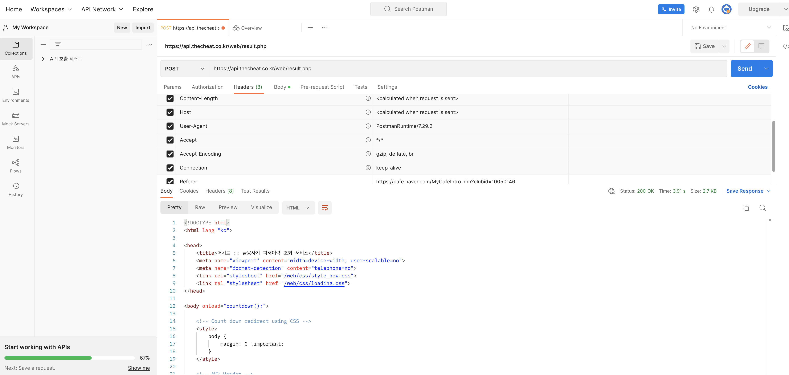

## 9월 07일

1. referer에 대하여

---

<h2>리퍼러에 대하여</h2>

- referer(리퍼러)는 http의 해더 중 하나로 `어떤 웹사이트나 웹서버에서 방문자가 왔는지 파악` 힐 수 있으며 ` 서버는 현재 표시하는 웹페이지가 어떤 웹페이지 에서 요청 되었는지 알수있다.`

- referer을 확인하는 방법으로는 웹 Console에 `document.referrer`을 입력해서 확인하거나 Network에서 요청헤더들의 referer을 보면 알 수 있다.
- 하지만 이러한 리퍼러는 악용할수 있기에 리퍼러를 안보이게 할 수 있고. 크롬 또한 리퍼러를 조작하거나 임의로 바꾸는 행위를 막고있다.
- 그렇다면 referer을 웹이 아닌 서버에서 주어주면 어떨까.

```javascript
let options = {
  url: thecheat_url,
  headers: {
    referer: ref,
  },
  form: {
    keyword: req.query.number,
    url: form_url,
  },
};
```

- node.js로 만든 웹서버에서 이러한 요청을 보내본 결과, 관련 api와 데이터를 주고 받을 수 있었다.
- 기존 형태는 form태그에서 action에 링크로 폼안에 내용을 submit하는 간단한 위젯이였지만 받는 쪽에서 리퍼러를 검사하기에 웹에서는 사용이 불가능 했고 서버에서는 연결이 된것
  </img>

- 포스트맨으로 확인시 이러한 html형식의 데이터를 받게되는 것이다.
- html에서는 header에 meta 태그를 사용해서 referer의 노출도를 제어할 수 있는데 그것을 `Referrer-Policy`라고 한다.
<h3>Syntax</h3>

```
Referrer-Policy: no-referrer
Referrer-Policy: no-referrer-when-downgrade
Referrer-Policy: origin
Referrer-Policy: origin-when-cross-origin
Referrer-Policy: same-origin
Referrer-Policy: strict-origin
Referrer-Policy: strict-origin-when-cross-origin
Referrer-Policy: unsafe-url
```
- html에 meta태그에 적용 시
```javascript
<meta name="referrer" content="origin">
```

- 개별 요청에 대한 리퍼러 정책을 설정하려면 요소에 `referrerpolicy`속성을 지정 할 수 있다
```javascript
<a href="http://example.com" referrerpolicy="origin">
```
