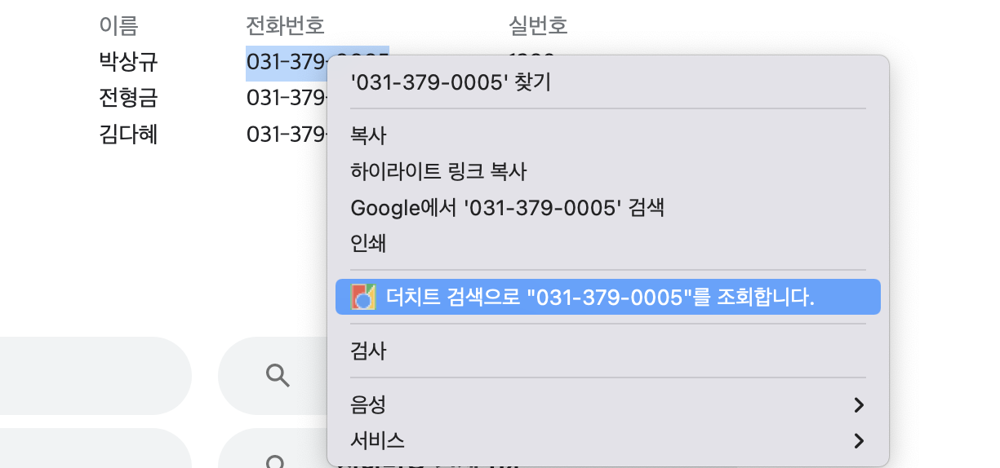

## 9월 13일

1. 네이버 위젯을 이용한 익스텐션

---

<h2>네이버 위젯을 이용한 익스텐션</h2>

- 네이버 중고나라 카페에 있는 더치트 검색위젯을 사용하여 익스텐션을 만들어보자.

- 우선 fetch를 사용해 header 안에 referer을 조작해 보내는건 크롬 오류가 떠서 막혔다.(추후에 다시 시도해보자)

- 그래서 전과 같이 서버를 이용하는 방법으로 만들었다.

```javascript
const thecheat_url = "https://api.thecheat.co.kr/web/result.php";
const ref = "https://cafe.naver.com/MyCafeIntro.nhn?clubid=10050146";
const form_url = "cafe.naver.com";
const port = "3000";

app.use(express.static("public"));
app.use(cors());

app.get("/post", function (req, res) {
  let options = {
    url: thecheat_url,
    headers: {
      referer: ref,
    },
    form: {
      keyword: req.query.number,
      url: form_url,
    },
  };
  // res.header('referer', ref);
  // res.redirect(thecheat_url); redirect로 전송시 cors오류 발생

  request.post(options, function (error, response, body) {
    if (!error && response.statusCode == 200) {
      const str = body.split(`"`);
      opn(`https://api.thecheat.co.kr${str[49]}`);
      res.end();
    } else {
      res.status(response.statusCode).end();
      console.log("error = " + response.statusCode);
    }
  });
});
```

 - 응답으로 받는 html형식의 string을 배열로 나누고 거기서 필요한 정보만 꺼내서 url로 이동하는 방식을 썼다.

 - 이렇게 하면 앞에서 했던 다른 익스텐션과 다를거 없는 팝업 html을 사용한 익스텐션이기에 다른 기능을 추가해봤다.

 - 서비스워커를 이용해 팝업을 열지 않아도 검색할수 있는 기능을 추가했다.

 ```javascript
//  background.js

 chrome.contextMenus.create({
  id: "thecheat",
  title: '더치트 검색으로 "%s"를 조회합니다.',
  contexts: ["selection"],
  onclick: chrome.contextMenus.onClicked.addListener(function (info) {
    chrome.tabs.create(
      {
        url: `http://localhost:3000/post?number=${info.selectionText}`,
      },
      function (tab) {
		let base = parseInt(tab.id)
		console.log(base)
		  chrome.tabs.remove(base)
      }
    );
  }),
});

 ```

 - 이런식으로 크롬에서 제공하는 api들을 사용해 오른쪽클릭으로 간단하게 검색할수있는 기능을 추가했다.

 - `remove`를 넣은 이유는 로컬에서 요청을 받고 또 새창을 띄우면 `chrome.tabs.create` 로 열은 로컬3000은 쓸모가 없는 창이되기에 바로 닫게했다.

 - 이런식으로 크롬 익스텐션 api를 사용하면 `manifest.json`에 권한을 적어줘야한다.

```json
{
    "name": "위젯을이용한 더치트 검색.",
    "description": "간단하게 검색",
    "version": "1.0",
    "manifest_version": 3,
    "action": {
        "default_popup" : "index.html"
    },
    "background" : {
        "service_worker" : "background.js"
    },
    "permissions": [
        "tabs",
        "contextMenus",
        "storage"
      ],
      "icons" : {
          "16": "get_started16.png"
      }
}

```

 - 여기서 아이콘 16크기는 오른쪽클릭으로 만들어질 `contextMenus`에 들어갈 아이콘이기도 하다.

 </img>

  - 성공했다면 이런식으로 팝업이 없어도 검색이 가능해진다.